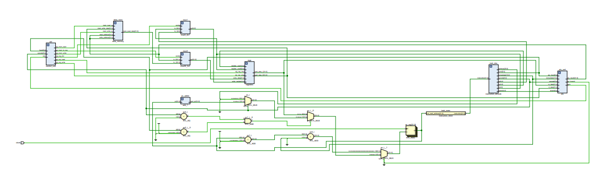

# MIPS_32

Verilog implementation of 32-bit MIPS processor supporting the instructions add, sub, and, or , lw, sw, beq, bne, J, JR. Also included schematic for better understanding.


## How to Run


**Required Compiler:** ```Synopsys VCS Commpiler```

1. write mips 32 bit instructions for the code that you want to execute in the file ```mips_tb.v```.
2. There are 3 files for instruction memory, data memory and register memory files.
3. edit the files to provide any initial values.
4. Run the command ```runvcs mips_tb.v mips_design.v``` to execute the assembly code.
5. The above command will generate the ```mips_dump.vcd``` file in order to observe the dump waves.

## Supported Instructions

Instruction | Opcode | Funct | Syntax | Explanation
------------|--------|-------|--------|---------
add         |000000  |100000 |add $1, $2, $3 | $3 = $1 + $2
sub         |000000  |100010 |sub $1, $2, $3 | $3 = $1 - $2
and         |000000  |100100 |and $1, $2, $3 | $3 = $1 & $2
or          |000000  |100101 |or $1, $2, $3  | $3 = $1 \| $2
lw          |100011  |       |lw $1 4($2)    | $1 = load($2 + 4)
sw          |101011  |       |sw $2 5($3)    | $2 = load($3 + 5)
beq         |000100  |       |beq $1, $2, 4  | jumps 4 instructions ahead if $1 == $2
bne         |000101  |       |bne $1, $2, 4  | jumps 4 instructions ahead if $1 != $2
j           |000010  |       |j 7            | jumps tp pc = pc + offset


## Schematic Datapath



## Modules

1. mips, core component for processor
2. instruction_fetch, to fetch the instructions from the instruction memory
3. instruction_decode, to decode the instruction in to rs, rt, rd, shamt, opcode, function, immediate and address.
4. control_unit, to control all the signals accrding to the instruction given.
5. registers, to store all the register values.
6. alu, to perform all the arithmatic operations.
7. data_memory, to store all the data.

## References

1. [Explanation of MIPS 32 bit ISA](https://www.cs.nthu.edu.tw/~ychung/slides/CSC3050/MIPS-ISA.pdf)

2. [Table of MIPS instructions and corresponding opcodes](https://opencores.org/projects/plasma/opcodes)
